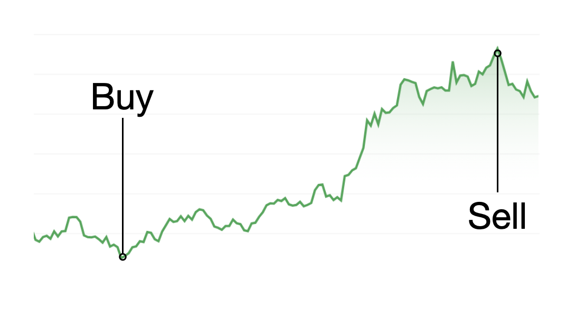
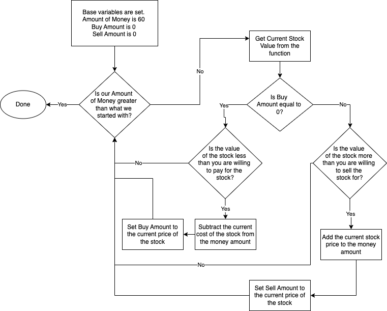
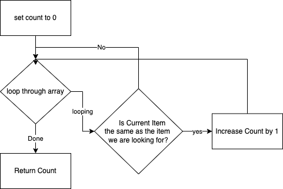

## Loop Challenges
We have two challenges for you today.  The first is on using a while loop since we can  not predict how many times it will run.  The second is on using a for loop to go through an array.  This is a common task that we do in app development. 
 

## While Loop Stock Market
Our goal is to buy low and sell high by using some conditionals and a while loop. We will be using a function called generateStockValue.  It behaves like the real stock market in that we can not predict what the price is going to do.  Note that this would be an extremely volital stock since it is completely random. 

### Requirements 
* When you buy (buyAmount variable gets set), You need to subtract that amount from moneyAmount
* When you sell (sellAmount variable gets set), You need to add that amount to the moneyAmount
* You should not sell before you buy
* You should not buy more than you start with so in this example it shouldn't be more than $60
* This should only run though one buy and sell cycle so it should quit looping once you are profitable (You can hard code that value in)
* Make sure you do not sell for less than what you bought for. This could result in an infinite loop.

### Flowchart 
It might help to flowchart this out.  You can either create your own solution or take a peak at this flowchart which should work. 

### Check Your Code
Once you have your code in, run the unit test and see if it passes. 

## Array Items Count Chalenge
In this challenge, we have a function set up for you that takes two inputs.  The first is an array called inputArray which is an array of ints.  The second is a variable named value that is an int.  This is the value you will be looking for in the array.  

### Count Flowchart
This is a common software pattern.  We start by creating a variable that is set to 0.  Then we loop through the array.  Each time through the loop, we check if the current value matches the value we are looking for.  If it does, we add one to our count variable. When we are done, we simply return our count variable. 

 

### Check Your Code 
Once you have your code in, run the unit test and see if it passes. 
