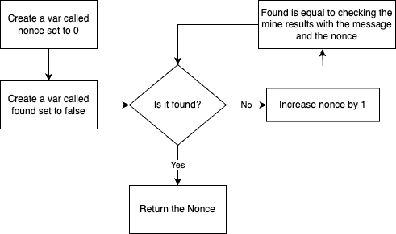

## Loop Challenges
We have two challenges for you today.  The first is on using a while loop since we can  not predict how many times it will run.  The second is on using a for loop to go through an array.  This is a common task that we do in app development. 
 

## Bitcoin Miner (Super Simple Simulated One)
We are going to implement one of the core parts of a Bitcoin Minor. It's the part that tries to solve the puzzle.  Part of mining is that it requires a computer to do a bunch of calculations until it finds a correct number.  It is not a problem you can solve with algebra so the computer is left asking over and over again if a value is correct.  It's using guess and check until if finds the correct answer. It usually has to run for a while but if they get the correct answer first, they get rewarded Bitcoin. 

🐿️ is it 1?
  
 💻 No

🐿️ is it 2

 💻 No

🐿️ is it 3

 💻 Yes

 🐿️ Sweet, give me some Bitcoin.

### Requirements 
* You will need a variable to keep track of the current number which is called a nonce.
* You will call the mine function with the message and your number to get either a true or a false.  If it is false you will increase your nonce and try again. Once you get a true, you will need to break out of the loop and return the nonce.
  

### Flowchart 
It might help to flowchart this out.  You can either create your own solution or take a peak at this flowchart which should work. 

### Check Your Code
Once you have your code in, run the unit test and see if it passes. 

  
## Array Items Count Challenge
In this challenge, we have a function set up for you that takes two inputs.  The first is an array called inputArray which is an array of ints.  The second is a variable named value that is an int.  This is the value you will be looking for in the array.  

### Count Flowchart
This is a common software pattern.  We start by creating a variable that is set to 0.  Then we loop through the array.  Each time through the loop, we check if the current value matches the value we are looking for.  If it does, we add one to our count variable. When we are done, we simply return our count variable. 

 

### Check Your Code 
Once you have your code in, run the unit test and see if it passes. 
